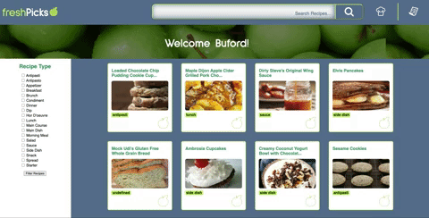
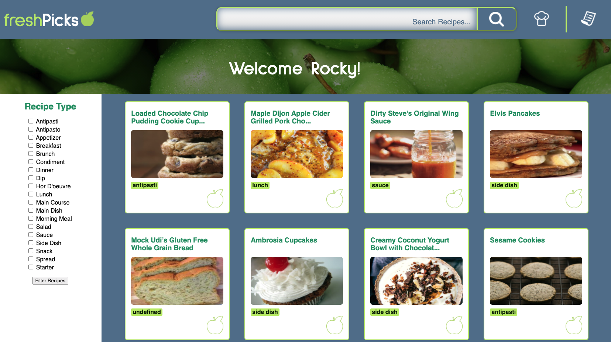
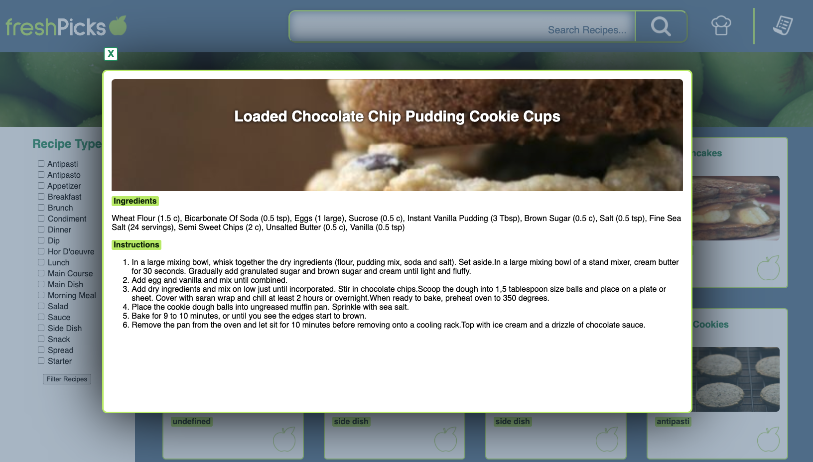
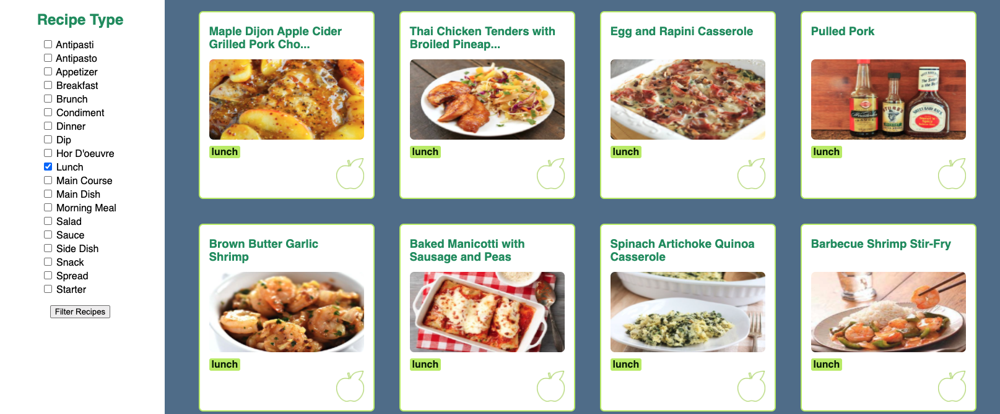
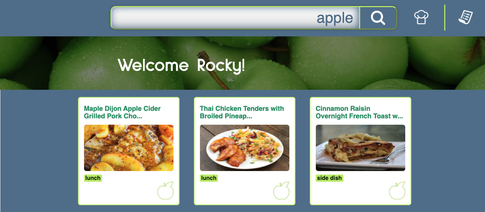
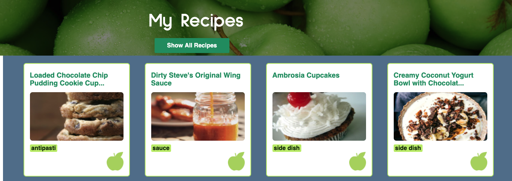
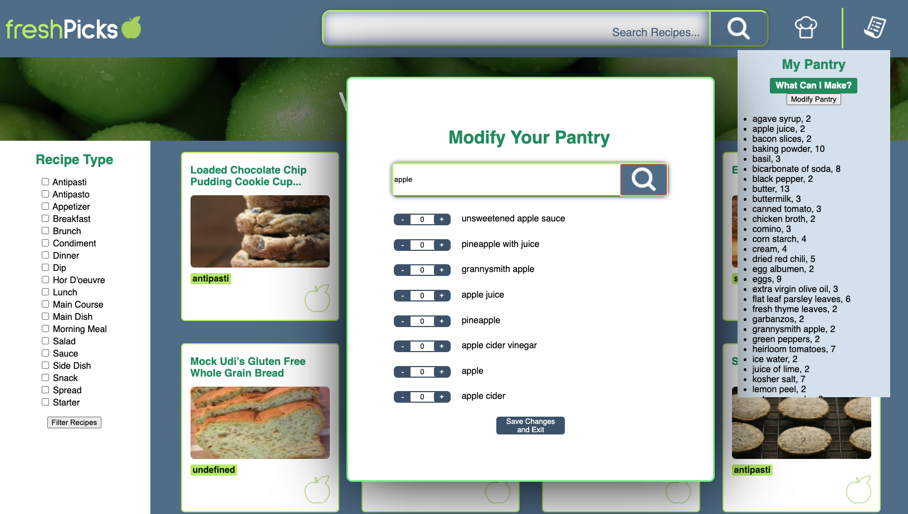

 

  

  <h3 align="center">Refactor Tractor</h3>

  

    Mod 2 Refactor Group Project (What's Cookin')
     
    <a href="https://github.com/ericberglund117/Refactor-tractor-WC-EB-KM-CD"><strong>Repo Link</strong></a>
     
     
  

## About The Project

This project is part of Turing Software and Designs' Front-End Program, Module 2. The project focuses on refactoring a previously created application (with a handful of noticeable bugs and problematic functions). The program is implemented with ES6 syntax and exclusively uses array-prototype methods whenever iterations need to be performed. There are no for loops used in the program. Three databases were supplied, each representing a large chunk of data for randomly generated users, recipes, and ingredients. Our task is to create several objects containing methods which would dynamically display a given users' data on the DOM. This program also introduces these students to the use of Fetch (GETs and POSTs), Webpack, and Spies. These will be implemented to test the DOM manipulation functions (Spies), bundle files together (Webpack), and receive/change data available on the server (Fetch).

### Built With

* Node.js
* Mocha
* Chai
* Spies
* Webpack

### Installation
In your terminal:
1. Clone the repo-
`git clone git@github.com:ericberglund117/Refactor-tractor-WC-EB-KM-CD.git`

2. Install NPM packages- `npm install`

## Usage
#### MAIN PAGE VIEW

#### RECIPE INSTRUCTIONS VIEW

#### RECIPE SORT FEATURE

#### RECIPE SEARCH FEATURE

#### MY RECIPES VIEW

#### PANTRY FEATURE

## Roadmap

The total time allotted for this project was approximately 12 days. Future features contemplated by the developers include the following:

* Tabbing through the app is functional, but we would love to see ways to improve on the accessibility.
* We would ideally like to add a feature to add items to a grocery list according to what is needed for a specific recipe. These methods are available on the Recipe class, so this would be a nice next step.
* Allowing the user to rate a recipe or offer tips/notes after confirming that they have cooked it would be a great addition to the app.
* Adding an allergen search for recipes would be great for accessibility on a whole new level.

See the [open issues](https://github.com/ericberglund117/Refactor-tractor-WC-EB-KM-CD/issues) for a list of proposed features (and known issues).

## Contact

 [Eric Berglund](https://github.com/ericberglund117)

 [Kristi Miller](https://github.com/Kristiannmiller)

 [Chadrick Dickerson](https://github.com/chadrick-d-dev)

Project Link: [Refactor-Tractor (What's Cookin') Repo](https://github.com/ericberglund117/Refactor-tractor-WC-EB-KM-CD)

## Acknowledgements

Robert Gu - This developer team would like to thank Turing Module 2 anchor instructor Robert Gu for his assistance throughout this project and for his daily lessons on the magic of Javascript.

Travis Rollins - We would also like to thank Turing Module 2 instructor Travis Rollins for his guidance and assistance on this project and the module in general

Our Turing Mentors - Including Turing-wide mentor John Adams, and Turing graduates Jon Sweet, Pol Sieira, Eric Fitzsimons, and Aimee Fritz for their constant support throughout this challenging project.
